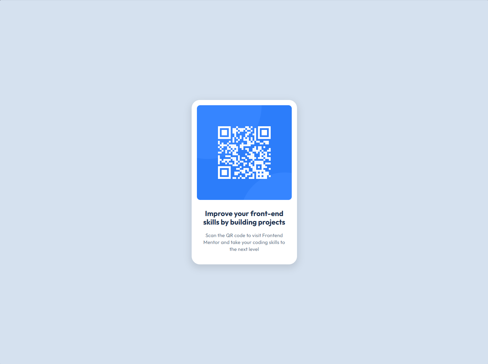

# Frontend Mentor - QR code component solution

This is a solution to the [QR code component challenge on Frontend Mentor](https://www.frontendmentor.io/challenges/qr-code-component-iux_sIO_H).

## Overview

### Screenshot

### Links

- Solution URL: [Github](https://github.com/rradiohysteria/qr-code-component)
- Live Site URL: [Github Pages](https://rradiohysteria.github.io/qr-code-component/)

## My process

### Built with

- Semantic HTML5 markup
- CSS custom properties
- Flexbox

### What I learned

Working with Figma's design layout and style guide to pluck out values needed to position everything correctly on page. Was extremely helpful and removed the guesswork out of it.  
